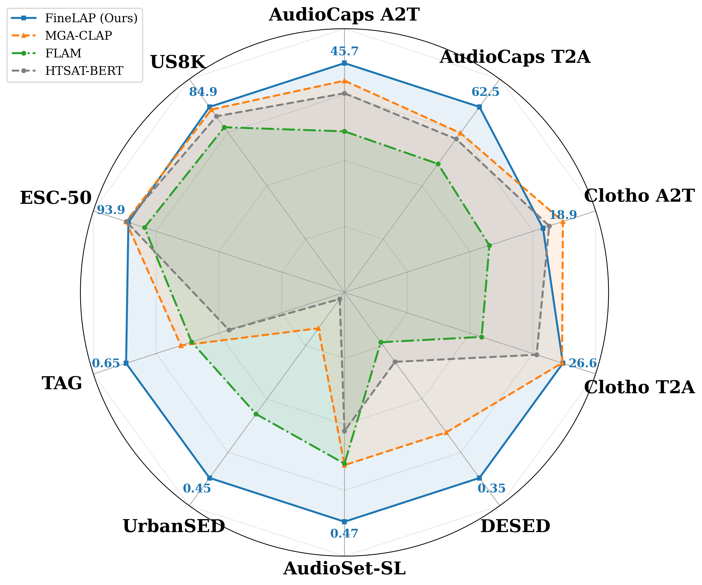
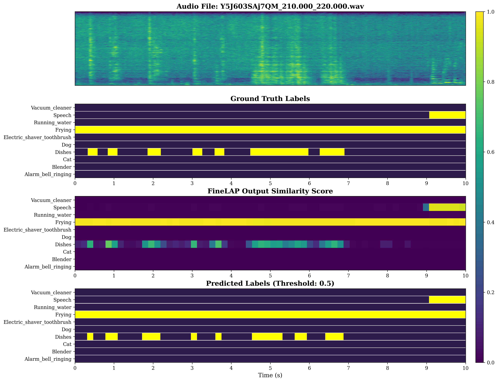

<div align="center">
<p align="center">
  <h1>FineLAP: Taming Heterogeneous Supervision for Fine-grained Language-Audio Pretraining</h1>
  <!-- <a href=>Paper</a> | <a href="https://meanaudio.github.io/">Webpage</a>  -->

  <!-- [](https://arxiv.org/abs/2603.11661) -->
  [](https://huggingface.co/AndreasXi/FineLAP)
  [](https://huggingface.co/datasets/AndreasXi/FineLAP-100k)

  
  <!-- [](https://huggingface.co/spaces/chenxie95/Resonate)
  [](https://resonatedemo.github.io/) -->
</p>
</div>
TL;DR: FineLAP is a strong contrastively pre-trained audio-language model that excels in both clip- and frame-level audio understanding tasks. 


<div align="center">
  
  
</div>

<!-- ## Overview  -->

## Model Checkpoints

We provide two formats of FineLAP checkpoints:

- [Hugging Face model](https://huggingface.co/AndreasXi/FineLAP): for quick start and feature extraction.
- [PyTorch model](https://huggingface.co/AndreasXi/FineLAP_Pytorch): for further fine-tuning and training.

## Quick Start
Simply install the required packages: 
```
git clone https://github.com/xiquan-li/FineLAP
cd FineLAP
pip install -r requirements_infer.txt
```

Then run the following commands to extract frame- and clip- level features or calculate similarity: 

```python
import torch
from transformers import AutoModel

audio_path = ['resources/1.wav', 'resources/2.wav']  # (B,)
caption = ["A woman speaks, dishes clanking, food frying, and music plays", 'A power tool is heard with male speech.']  # (B,)
phrases = ['Speech', 'Dog', 'Cat', 'Frying', 'Dishes', 'Music', 'Vacuum', 'Type', 'Power tool']  # (N,)


device = torch.device("cuda" if torch.cuda.is_available() else "cpu")

model = AutoModel.from_pretrained("AndreasXi/FineLAP", trust_remote_code=True).to(device)
model.eval()

with torch.no_grad():
    global_text_embeds = model.get_global_text_embeds(caption)  # (B, d)
    print(global_text_embeds.shape)

    global_audio_embeds = model.get_global_audio_embeds(audio_path)   # (B, d)
    print(global_audio_embeds.shape)

    dense_audio_embeds = model.get_dense_audio_embeds(audio_path)  # (B, T, d)
    print(dense_audio_embeds.shape)

    clip_scores = model.get_clip_level_score(audio_path, caption)  # (B, B)
    print(clip_scores.shape)

    frame_scores = model.get_frame_level_score(audio_path, phrases)  # (B, N, T)
    print(frame_scores.shape)
    
    ## (Optional) Plot frame-level similarity, only supprt single audio file
    model.plot_frame_level_score(audio_path[1], phrases, output_path="output/output_plot.png")
```


## Training 
Before training, make sure that all files from [here](https://huggingface.co/AndreasXi/FineLAP_Pytorch) have been downloaded to `./weights/`. 

### Environmental Setup:
```
conda create -n finelap python=3.9 

git clone https://github.com/facebookresearch/fairseq.git
pip install "pip<24.1" -U; cd fairseq; pip install -e ./

pip install -r requirements_train.txt
```

### Data Setup
To train FineLAP, we format the data in a JSONL structure as follows:

```
{
  "audio_id": "Ycq6bqC_AsO4.flac",
  "audio_path": "path/to/audio.wav",
  "caption": "Birds are chirping with background noise.",
  "phrases": [
    {
      "phrase": "Background noise",
      "segments": [
        [0.498, 10.0]
      ]
    },
    {
      "phrase": "Bird vocalization, bird call, bird song",
      "segments": [
        [0.629, 4.114],
        [4.313, 10.0]
      ]
    }
  ]
}
```

Each entry contains:

- audio_id: Unique identifier of the audio sample.
- audio_path: Path to the audio file.
- caption: A clip-level description of the audio content.
- phrases (optional): A list of sound events, where each includes:
  - phrase: Textual phrase of the event
  - segments: Time intervals (in seconds) indicating when the event occurs

For data without frame-level annotations, the `phrases` field can be omitted. The dataset will automatically detect this and skip the frame-level loss for such samples.
An example training metadata file with 10 samples is provided at `data/training_metadata_example.jsonl`.

Once the dataset metadata JSONL is ready, remember to include it in the `train_data_args.metadata_files` list defined in the config `config/data_config.data_eat.yaml`.

### Start Training
Run
```
bash scripts/train.sh
```
to start training. This will use the config `config/finelap_eat_config.yaml`. The output will be saved in `exps/${exp_name}`. 

## Infer 
After training, you can use `scripts/infer.sh` to do inference. 
Change `ckpt_path` to the ckpt you obtained from training. 
The script will 
- compute global audio-text similarity between the audio and the caption
- compute frame-level similarity between the audio and each phrase
- save a frame-level heatmap under `output/<audio_name>/similarity_<audio_name>.png`
- save the inference summary under `output/<audio_name>/results_<audio_name>.json`


## The FineLAP-100K Dataset 

We provide a large-scale synthetic SED dataset [here](https://huggingface.co/datasets/AndreasXi/FineLAP-100k).  The dataset is constructed using our proposed scalable pipeline.


## Eval
TODO

## Citation
TODO