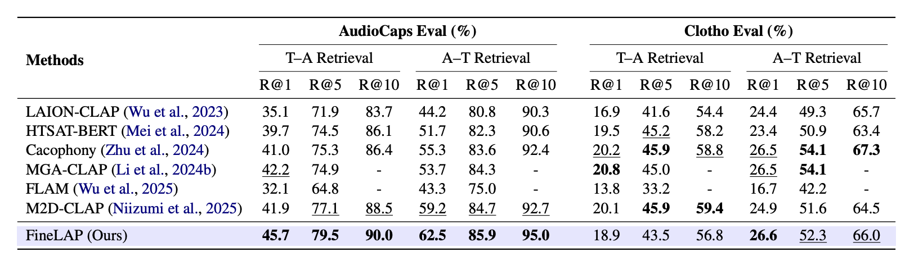
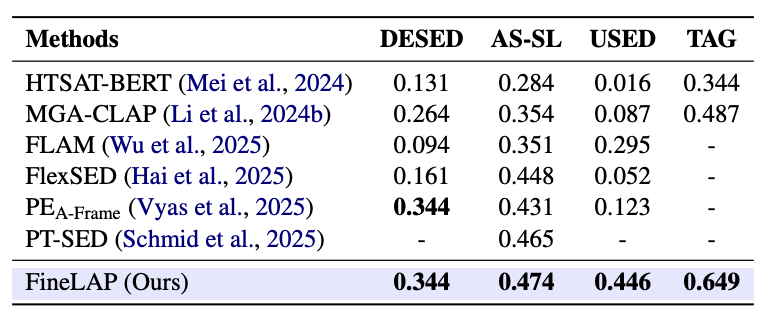
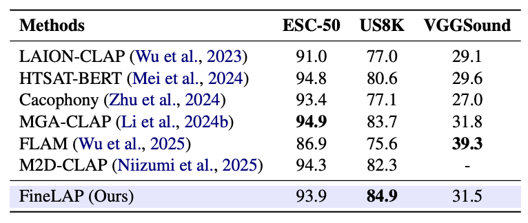

<div align="center">
<p align="center">
  <h1>FineLAP: Taming Heterogeneous Supervision for Fine-grained Language-Audio Pretraining</h1>
  <!-- <a href=>Paper</a> | <a href="https://meanaudio.github.io/">Webpage</a>  -->

  [](https://arxiv.org/abs/2604.01155)
  [](https://huggingface.co/AndreasXi/FineLAP)
  [](https://huggingface.co/datasets/AndreasXi/FineLAP-100k)

  
  <!-- [](https://huggingface.co/spaces/chenxie95/Resonate)
  [](https://resonatedemo.github.io/) -->
</p>
</div>

<br>

<div align="center">
  
  
</div>

<br>

**TL;DR**: FineLAP is a strong contrastively pre-trained audio-language model that excels in both clip- and frame-level audio understanding tasks. 

<!-- ## Overview  -->

## Model Checkpoints

We provide two formats of FineLAP checkpoints:

- [Hugging Face model](https://huggingface.co/AndreasXi/FineLAP): for quick start and feature extraction.
- [PyTorch model](https://huggingface.co/AndreasXi/FineLAP_Pytorch): for further fine-tuning and training.

## Quick Start
Simply install the required packages: 
```bash
git clone https://github.com/xiquan-li/FineLAP
cd FineLAP
pip install -r requirements_infer.txt
```

Then run the following commands to extract frame- and clip- level features or calculate similarity: 

```python
import torch
from transformers import AutoModel

audio_path = ['resources/1.wav', 'resources/2.wav']  # (B,)
caption = ["A woman speaks, dishes clanking, food frying, and music plays", 'A power tool is heard with male speech.']  # (B,)
phrases = ['Speech', 'Dog', 'Cat', 'Frying', 'Dishes', 'Music', 'Vacuum', 'Type', 'Power tool']  # (N,)


device = torch.device("cuda" if torch.cuda.is_available() else "cpu")

model = AutoModel.from_pretrained("AndreasXi/FineLAP", trust_remote_code=True).to(device)
model.eval()

with torch.no_grad():
    global_text_embeds = model.get_global_text_embeds(caption)  # (B, d)
    print(global_text_embeds.shape)

    global_audio_embeds = model.get_global_audio_embeds(audio_path)   # (B, d)
    print(global_audio_embeds.shape)

    dense_audio_embeds = model.get_dense_audio_embeds(audio_path)  # (B, T, d)
    print(dense_audio_embeds.shape)

    clip_scores = model.get_clip_level_score(audio_path, caption)  # (B, B)
    print(clip_scores.shape)

    frame_scores = model.get_frame_level_score(audio_path, phrases)  # (B, N, T)
    print(frame_scores.shape)
    
    ## (Optional) Plot frame-level similarity, only supprt single audio file
    model.plot_frame_level_score(audio_path[1], phrases, output_path="output/output_plot.png")
```


## Training & Fine-tuning
Please refer to [this document](resources/training.md). 

## Inference
Use 
```bash scripts/infer.sh```
to do inference. Please set `ckpt_path` to your trained checkpoint. The script computes clip-level similarity from a `caption`, frame-level similarity from `phrases`, and saves the heatmap plus a summary JSON under `output/<audio_name>/`.

The script also works with the [Pytorch FineLAP checkpoint](https://huggingface.co/AndreasXi/FineLAP_Pytorch).

## The FineLAP-100K Dataset 

We provide a large-scale synthetic SED dataset [here](https://huggingface.co/datasets/AndreasXi/FineLAP-100k).  The dataset is constructed using our proposed scalable pipeline.


## Evaluation
TODO

## Performance 
FineLAP achieves state-of-the-art results on a wide range of audio understanding tasks, including audio-text retrieval, zero-shot audio classification, text-to-audio grounding, and sound event detection. 
<div align="center">
  
</div>

<div align="center">
  
  
</div>

## Citation
TODO
